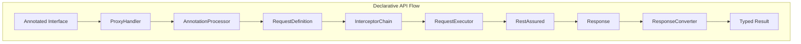

# Declarative API Design for Hex Framework

## Overview
This document outlines the architectural design for incorporating a declarative API approach similar to Retrofit2 into the Hex framework, while maintaining backward compatibility and flexibility for complex scenarios requiring imperative RestAssured code.

## Design Goals
1. **Developer Productivity**: Enable developers to define API contracts using simple Java interfaces with annotations
2. **Type Safety**: Leverage compile-time checking for API contracts and DTOs
3. **Modularity**: Highly modular design with single responsibility components
4. **Extensibility**: Easy to extend with custom interceptors, converters, and handlers
5. **Simplicity**: Pure declarative approach for MVP - imperative support can be added later if needed
6. **Testability**: Maintain excellent logging, reporting, and retry capabilities

## Architecture Overview

### Pure Declarative Approach
The framework provides a clean, annotation-driven API testing experience:



## Declarative API Annotations

### Core Annotations
```java
package com.company.hex.api.annotations;

// HTTP Method Annotations
@Target(ElementType.METHOD)
@Retention(RetentionPolicy.RUNTIME)
public @interface GET {
    String value() default "";
}

@Target(ElementType.METHOD)
@Retention(RetentionPolicy.RUNTIME)
public @interface POST {
    String value() default "";
}

@Target(ElementType.METHOD)
@Retention(RetentionPolicy.RUNTIME)
public @interface PUT {
    String value() default "";
}

@Target(ElementType.METHOD)
@Retention(RetentionPolicy.RUNTIME)
public @interface DELETE {
    String value() default "";
}

@Target(ElementType.METHOD)
@Retention(RetentionPolicy.RUNTIME)
public @interface PATCH {
    String value() default "";
}

// Parameter Annotations
@Target(ElementType.PARAMETER)
@Retention(RetentionPolicy.RUNTIME)
public @interface Path {
    String value();
}

@Target(ElementType.PARAMETER)
@Retention(RetentionPolicy.RUNTIME)
public @interface Query {
    String value();
}

@Target(ElementType.PARAMETER)
@Retention(RetentionPolicy.RUNTIME)
public @interface Header {
    String value();
}

@Target(ElementType.PARAMETER)
@Retention(RetentionPolicy.RUNTIME)
public @interface Body {
}

@Target(ElementType.PARAMETER)
@Retention(RetentionPolicy.RUNTIME)
public @interface FormParam {
    String value();
}

// Service Configuration
@Target(ElementType.TYPE)
@Retention(RetentionPolicy.RUNTIME)
public @interface ApiService {
    String baseUrl() default "";
    String basePath() default "";
}

// Response Handling
@Target(ElementType.METHOD)
@Retention(RetentionPolicy.RUNTIME)
public @interface Headers {
    String[] value();
}

@Target(ElementType.METHOD)
@Retention(RetentionPolicy.RUNTIME)
public @interface Retry {
    int count() default 3;
    long delay() default 1000;
}
```

## Implementation Strategy

### 1. Declarative Interface Example
```java
package com.company.hex.project.api.services;

import com.company.hex.api.annotations.*;
import com.company.hex.project.api.dto.*;
import io.restassured.response.Response;
import java.util.List;

@ApiService(basePath = "/api")
public interface UserApiDeclarative {
    
    @GET("/users")
    Response getAllUsers();
    
    @GET("/users")
    List<UserDto> getAllUsersTyped();
    
    @GET("/users/{id}")
    UserDto getUserById(@Path("id") int userId);
    
    @GET("/users/search")
    List<UserDto> searchUsers(@Query("name") String name, 
                              @Query("age") Integer age);
    
    @POST("/users")
    @Headers({"Content-Type: application/json"})
    UserDto createUser(@Body CreateUserRequest request);
    
    @PUT("/users/{id}")
    @Retry(count = 5, delay = 2000)
    UserDto updateUser(@Path("id") int userId, 
                       @Body UpdateUserRequest request);
    
    @DELETE("/users/{id}")
    Response deleteUser(@Path("id") int userId);
    
    @POST("/users/{id}/avatar")
    @Headers({"Content-Type: multipart/form-data"})
    Response uploadAvatar(@Path("id") int userId,
                         @FormParam("file") byte[] fileContent,
                         @FormParam("filename") String filename);
}
```

### 2. Pure Declarative Service Example
```java
package com.company.hex.project.api.services;

@ApiService(baseUrl = "${api.base.url}")
public interface UserApi {
    
    @GET("/users")
    List<UserDto> getAllUsers();
    
    @GET("/users/{id}")
    UserDto getUserById(@Path("id") int userId);
    
    @GET("/users/search")
    List<UserDto> searchUsers(@Query("name") String name,
                              @Query("age") Integer age);
    
    @POST("/users")
    @Headers("Content-Type: application/json")
    UserDto createUser(@Body CreateUserRequest request);
    
    @PUT("/users/{id}")
    @Retry(count = 3, delay = 1000)
    UserDto updateUser(@Path("id") int userId,
                       @Body UpdateUserRequest request);
    
    @DELETE("/users/{id}")
    @ExpectedStatus(204)
    void deleteUser(@Path("id") int userId);
    
    @POST("/users/batch")
    @Headers("X-Batch-Operation: true")
    BatchResult batchUpdateUsers(@Body BatchUpdateRequest request);
}
```

### 3. Modular Service Factory
```java
package com.company.hex.api.service;

public final class ApiServiceFactory {
    
    private final RequestExecutor requestExecutor;
    private final ResponseConverter responseConverter;
    private final AnnotationProcessor annotationProcessor;
    private final InterceptorChain interceptorChain;
    
    private ApiServiceFactory(Builder builder) {
        this.requestExecutor = builder.requestExecutor;
        this.responseConverter = builder.responseConverter;
        this.annotationProcessor = builder.annotationProcessor;
        this.interceptorChain = builder.interceptorChain;
    }
    
    /**
     * Create API service from interface with default configuration.
     */
    public static <T> T create(Class<T> serviceInterface) {
        return new Builder().build().createService(serviceInterface);
    }
    
    /**
     * Create API service with custom configuration.
     */
    public static <T> T create(Class<T> serviceInterface, ApiConfig config) {
        return new Builder()
            .withConfig(config)
            .build()
            .createService(serviceInterface);
    }
    
    public <T> T createService(Class<T> serviceInterface) {
        ProxyHandler handler = new ProxyHandler(
            annotationProcessor,
            requestExecutor,
            responseConverter,
            interceptorChain
        );
        return ProxyFactory.create(serviceInterface, handler);
    }
    
    public static class Builder {
        // Builder pattern for flexible configuration
    }
}
```

### 4. Modular Component Architecture

```java
// Annotation Processing Module
package com.company.hex.api.processor;

public interface AnnotationProcessor {
    RequestDefinition process(Method method, Object[] args);
}

public class DefaultAnnotationProcessor implements AnnotationProcessor {
    private final List<ParameterHandler> parameterHandlers;
    private final List<MethodHandler> methodHandlers;
    
    public RequestDefinition process(Method method, Object[] args) {
        // Process method and parameter annotations
    }
}

// Request Execution Module
package com.company.hex.api.executor;

public interface RequestExecutor {
    Response execute(RequestDefinition request, ApiConfig config);
}

public class RestAssuredExecutor implements RequestExecutor {
    private final RetryPolicy retryPolicy;
    private final RequestLogger logger;
    
    public Response execute(RequestDefinition request, ApiConfig config) {
        // Execute with RestAssured
    }
}

// Response Conversion Module
package com.company.hex.api.converter;

public interface ResponseConverter {
    <T> T convert(Response response, Type returnType);
}

public class JacksonResponseConverter implements ResponseConverter {
    private final ObjectMapper mapper;
    private final ErrorHandler errorHandler;
    
    public <T> T convert(Response response, Type returnType) {
        // Convert response to return type
    }
}

// Interceptor Module
package com.company.hex.api.interceptor;

public interface Interceptor {
    Response intercept(Chain chain);
}

public class InterceptorChain {
    private final List<Interceptor> interceptors;
    
    public Response proceed(RequestDefinition request) {
        // Execute interceptor chain
    }
}

// Proxy Handler (Orchestrator)
package com.company.hex.api.proxy;

public class ProxyHandler implements InvocationHandler {
    private final AnnotationProcessor processor;
    private final RequestExecutor executor;
    private final ResponseConverter converter;
    private final InterceptorChain interceptors;
    
    @Override
    public Object invoke(Object proxy, Method method, Object[] args) {
        RequestDefinition request = processor.process(method, args);
        Response response = interceptors.proceed(request);
        return converter.convert(response, method.getGenericReturnType());
    }
}
```

## Usage Examples

### Example 1: Pure Declarative Approach
```java
@Test
public void testDeclarativeApi() {
    // Create service from interface
    UserApiDeclarative userApi = ApiServiceFactory.createDeclarative(UserApiDeclarative.class);
    
    // Type-safe API calls
    UserDto user = userApi.getUserById(123);
    assertThat(user.getName()).isNotEmpty();
    
    // Search with query parameters
    List<UserDto> users = userApi.searchUsers("John", 25);
    assertThat(users).isNotEmpty();
}
```

### Example 2: Advanced Declarative Features
```java
@Test
public void testAdvancedDeclarativeFeatures() {
    UserApi userApi = ApiServiceFactory.create(UserApi.class);
    
    // Type-safe API calls with automatic retry
    UserDto user = userApi.getUserById(123);
    assertThat(user.getName()).isNotEmpty();
    
    // Batch operations with custom headers
    BatchResult result = userApi.batchUpdateUsers(
        BatchUpdateRequest.builder()
            .userIds(List.of(1, 2, 3))
            .updates(Map.of("status", "active"))
            .build()
    );
    
    assertThat(result.getSuccessCount()).isEqualTo(3);
}
```

### Example 3: Custom Interceptors for Complex Logic
```java
// For complex scenarios, use custom interceptors
public class GraphQLInterceptor implements Interceptor {
    @Override
    public Response intercept(Chain chain) {
        RequestDefinition request = chain.request();
        
        // Transform REST call to GraphQL
        if (request.getPath().startsWith("/graphql")) {
            // Custom GraphQL logic
            return executeGraphQLQuery(request);
        }
        
        return chain.proceed(request);
    }
}

// Register interceptor
ApiServiceFactory.builder()
    .addInterceptor(new GraphQLInterceptor())
    .build()
    .create(UserApi.class);
```

## Implementation Strategy

### Phase 1: Core Declarative Framework
1. Implement annotation system and processor
2. Create dynamic proxy with modular components
3. Build service factory with clean API

### Phase 2: Essential Features
1. Type-safe response conversion
2. Retry and error handling
3. Logging and Allure integration

### Phase 3: Advanced Declarative Features
1. Custom interceptors for complex scenarios
2. Additional converters (XML, custom formats)
3. Advanced validation and error handling

## Benefits

### For Developers
- **Less Boilerplate**: No need to write RestAssured chains for simple operations
- **Type Safety**: Compile-time checking of API contracts
- **Readability**: API contracts are self-documenting
- **Flexibility**: Can mix approaches as needed

### For Framework
- **Backward Compatible**: Existing code continues to work
- **Extensible**: New annotations can be added easily
- **Maintainable**: Centralized request building logic
- **Testable**: Same logging, retry, and reporting capabilities

## Technical Considerations

### Thread Safety
- Proxy instances are thread-safe (stateless)
- Each method invocation creates new request
- Configuration remains immutable

### Performance
- Minimal overhead from reflection (cached)
- Same underlying RestAssured performance
- Proxy creation is one-time cost

### Error Handling
- Annotations validation at runtime
- Clear error messages for misconfiguration
- Fallback to RestAssured for edge cases

## Future Enhancements

### Potential Features
1. **Compile-time validation** via annotation processor
2. **OpenAPI integration** for automatic interface generation
3. **Response caching** annotations
4. **Circuit breaker** pattern support
5. **Metrics collection** annotations
6. **Request/Response interceptors**

### Annotation Processor (Future)
```java
@AutoGenerate(openApiSpec = "api-spec.yaml")
public interface GeneratedApiService {
    // Methods auto-generated from OpenAPI spec
}
```

## Conclusion
This hybrid approach provides the best of both worlds:
- Simple, declarative API definitions for common use cases
- Full flexibility of RestAssured for complex scenarios
- Smooth migration path from existing implementations
- No breaking changes to current codebase

The design aligns with Hex framework principles:
- **KISS**: Simple annotations for simple cases
- **YAGNI**: Start with runtime proxy, add compile-time later if needed
- **DRY**: Reuse existing `BaseApiService` infrastructure
- **SoC**: Clear separation between declaration and implementation