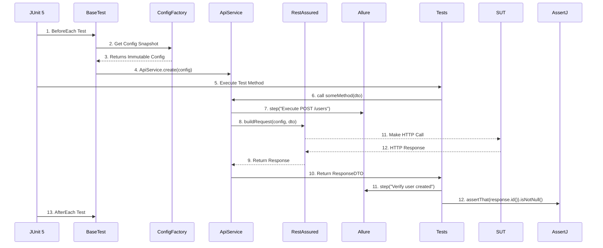
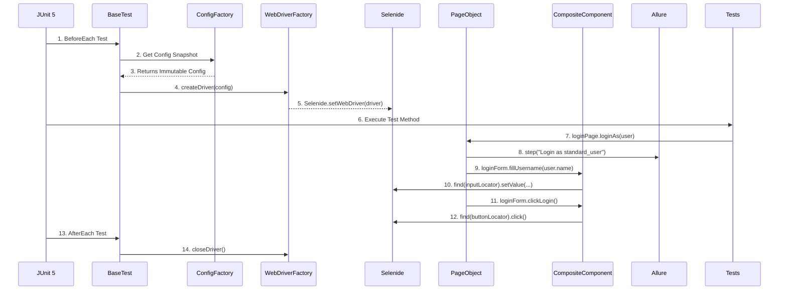

# Core Workflows

This section illustrates the primary interaction sequences between the framework components during test execution.

### API Test Execution Workflow
This diagram shows the sequence of events when a typical API test is executed using the Hex framework.

### UI Test Execution Workflow
This diagram shows the sequence for a UI test, highlighting the creation of a thread-safe driver session and interaction with PageObjects.

