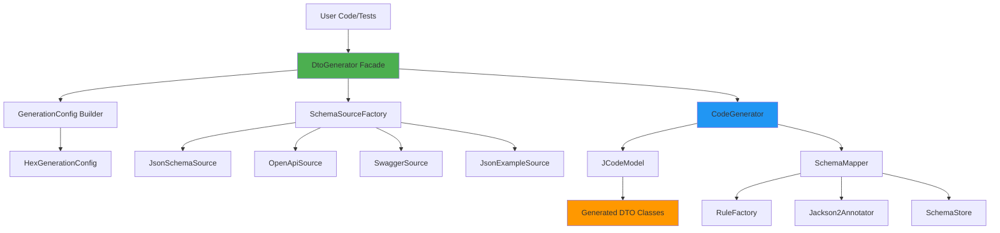

# DTO Generator Design for Hex Framework

## Overview

This document describes the design and architecture of helper classes in the `hex-core-api` module that provide a simple, flexible, and powerful way to generate DTO (Data Transfer Object) classes from JSON Schema, OpenAPI/Swagger specifications, or JSON examples using the jsonschema2pojo library.

## Design Goals

1. **Developer Productivity**: Eliminate manual DTO creation and maintenance
2. **Type Safety**: Auto-generate type-safe POJOs with proper Jackson annotations
3. **Flexibility**: Support multiple input sources (JSON Schema, OpenAPI, Swagger, JSON examples)
4. **Integration**: Seamless integration with Hex framework patterns and conventions
5. **Customization**: Provide sensible defaults with easy customization options
6. **KISS Principle**: Simple, intuitive API for common use cases
7. **Build Integration**: Support both runtime and build-time generation

## Architecture Overview

The DTO generator system consists of several modular components:



## Core Components

### 1. DtoGenerator - Main Facade

The primary interface for DTO generation. Provides fluent API for configuring and executing generation.

**Package**: `com.company.hex.api.generator`

```java
package com.company.hex.api.generator;

import com.sun.codemodel.JCodeModel;
import org.jsonschema2pojo.*;
import java.io.File;
import java.net.URL;
import java.nio.file.Path;

/**
 * Main facade for generating DTO classes from JSON Schema, OpenAPI, or JSON examples.
 * Provides a fluent API for easy configuration and execution.
 *
 * <p>Example usage:
 * <pre>
 * // Generate from JSON Schema file
 * DtoGenerator.builder()
 *     .fromJsonSchema("schemas/user.json")
 *     .withPackage("com.example.dto")
 *     .withClassName("UserDto")
 *     .generateToSourceRoot("src/main/java");
 *
 * // Generate from OpenAPI spec
 * DtoGenerator.builder()
 *     .fromOpenApi("api/swagger.json")
 *     .withBasePackage("com.example.api.dto")
 *     .generateAllSchemas()
 *     .toDirectory("src/main/java");
 * </pre>
 *
 * @author Hex Framework
 * @version 1.0
 */
public final class DtoGenerator {

    private final GenerationConfig config;
    private final SchemaSource source;
    private final Path outputDirectory;
    private final Logger logger = HexLoggerFactory.getLogger(DtoGenerator.class);

    private DtoGenerator(Builder builder) {
        this.config = builder.config;
        this.source = builder.source;
        this.outputDirectory = builder.outputDirectory;
    }

    /**
     * Create a new builder for configuring DTO generation.
     */
    public static Builder builder() {
        return new Builder();
    }

    /**
     * Quick generation from JSON Schema file with default settings.
     */
    public static DtoGenerationResult generateFromSchema(
            String schemaPath,
            String className,
            String packageName,
            String outputDir) {
        
        return builder()
            .fromJsonSchema(schemaPath)
            .withClassName(className)
            .withPackage(packageName)
            .generateToDirectory(outputDir);
    }

    /**
     * Generate DTOs from OpenAPI/Swagger specification.
     */
    public static DtoGenerationResult generateFromOpenApi(
            String openApiPath,
            String basePackage,
            String outputDir) {
        
        return builder()
            .fromOpenApi(openApiPath)
            .withBasePackage(basePackage)
            .generateAllSchemas()
            .toDirectory(outputDir);
    }

    /**
     * Execute the DTO generation.
     */
    public DtoGenerationResult generate() throws DtoGenerationException {
        // Implementation details below
    }

    /**
     * Fluent builder for configuring DTO generation.
     */
    public static class Builder {
        // Builder implementation
    }
}
```

### 2. HexGenerationConfig - Configuration Builder

Provides Hex-specific defaults and configuration options for DTO generation.

**Package**: `com.company.hex.api.generator.config`

```java
package com.company.hex.api.generator.config;

import org.jsonschema2pojo.DefaultGenerationConfig;
import org.jsonschema2pojo.SourceType;
import org.jsonschema2pojo.AnnotationStyle;

/**
 * Hex framework-specific generation configuration with sensible defaults.
 * Extends jsonschema2pojo's DefaultGenerationConfig with Hex conventions.
 *
 * <p>Default configuration:
 * <ul>
 *   <li>Jackson2 annotations for JSON serialization</li>
 *   <li>Lombok for reducing boilerplate (@Data, @Builder, etc.)</li>
 *   <li>Builder pattern enabled</li>
 *   <li>ToString, HashCode, Equals methods generated</li>
 *   <li>Ignore unknown properties</li>
 *   <li>Include Jackson annotations</li>
 * </ul>
 *
 * @author Hex Framework
 * @version 1.0
 */
public class HexGenerationConfig extends DefaultGenerationConfig {

    private boolean useLombok = true;
    private boolean generateBuilders = true;
    private boolean includeJacksonAnnotations = true;
    private boolean includeJsr303Annotations = false;
    private boolean ignoreUnknownProperties = true;
    private boolean includeToString = true;
    private boolean includeHashcodeAndEquals = true;
    private String dateTimeType = "java.time.LocalDateTime";
    private String dateType = "java.time.LocalDate";
    private String timeType = "java.time.LocalTime";

    public HexGenerationConfig() {
        // Initialize with Hex defaults
    }

    @Override
    public boolean isGenerateBuilders() {
        return generateBuilders;
    }

    @Override
    public boolean isUseLongIntegers() {
        return false; // Use int for integers by default
    }

    @Override
    public boolean isIncludeJsr303Annotations() {
        return includeJsr303Annotations;
    }

    @Override
    public SourceType getSourceType() {
        return SourceType.JSONSCHEMA;
    }

    @Override
    public AnnotationStyle getAnnotationStyle() {
        return AnnotationStyle.JACKSON2;
    }

    // Builder for customization
    public static class Builder {
        private final HexGenerationConfig config = new HexGenerationConfig();

        public Builder useLombok(boolean use) {
            config.useLombok = use;
            return this;
        }

        public Builder generateBuilders(boolean generate) {
            config.generateBuilders = generate;
            return this;
        }

        public Builder includeJsr303Validation(boolean include) {
            config.includeJsr303Annotations = include;
            return this;
        }

        public Builder ignoreUnknownProperties(boolean ignore) {
            config.ignoreUnknownProperties = ignore;
            return this;
        }

        public Builder dateTimeType(String type) {
            config.dateTimeType = type;
            return this;
        }

        public HexGenerationConfig build() {
            return config;
        }
    }
}
```

### 3. SchemaSourceFactory - Input Source Abstraction

Factory for creating different types of schema sources.

**Package**: `com.company.hex.api.generator.source`

```java
package com.company.hex.api.generator.source;

import java.net.URL;
import java.nio.file.Path;

/**
 * Factory for creating schema sources from various inputs.
 * Supports JSON Schema, OpenAPI, Swagger, and JSON examples.
 *
 * @author Hex Framework
 * @version 1.0
 */
public final class SchemaSourceFactory {

    private SchemaSourceFactory() {
        // Utility class
    }

    /**
     * Create source from JSON Schema file or classpath resource.
     */
    public static SchemaSource fromJsonSchema(String path) {
        return new JsonSchemaSource(resolveResource(path));
    }

    /**
     * Create source from JSON Schema URL.
     */
    public static SchemaSource fromJsonSchema(URL url) {
        return new JsonSchemaSource(url);
    }

    /**
     * Create source from OpenAPI 3.x specification.
     */
    public static SchemaSource fromOpenApi(String path) {
        return new OpenApiSource(resolveResource(path));
    }

    /**
     * Create source from Swagger 2.x specification.
     */
    public static SchemaSource fromSwagger(String path) {
        return new SwaggerSource(resolveResource(path));
    }

    /**
     * Create source from JSON example (infers schema).
     */
    public static SchemaSource fromJsonExample(String path) {
        return new JsonExampleSource(resolveResource(path));
    }

    private static URL resolveResource(String path) {
        // Try classpath first, then file system
        URL resource = SchemaSourceFactory.class.getClassLoader().getResource(path);
        if (resource != null) {
            return resource;
        }
        
        try {
            return Path.of(path).toUri().toURL();
        } catch (Exception e) {
            throw new IllegalArgumentException("Cannot resolve resource: " + path, e);
        }
    }
}
```

### 4. SchemaSource - Source Type Abstraction

```java
package com.company.hex.api.generator.source;

import java.net.URL;

/**
 * Represents a source of schema definitions.
 *
 * @author Hex Framework
 * @version 1.0
 */
public interface SchemaSource {
    
    /**
     * Get the URL to the schema source.
     */
    URL getUrl();
    
    /**
     * Get the type of this schema source.
     */
    SourceType getSourceType();
    
    /**
     * Get all schema definitions from this source.
     * For single schema files, returns a single-element collection.
     * For OpenAPI/Swagger, returns all component schemas.
     */
    Collection<SchemaDefinition> getSchemaDefinitions();
    
    enum SourceType {
        JSON_SCHEMA,
        OPEN_API,
        SWAGGER,
        JSON_EXAMPLE
    }
}
```

### 5. DtoGenerationResult - Generation Output

```java
package com.company.hex.api.generator;

import java.io.File;
import java.util.List;
import java.util.Map;

/**
 * Result of DTO generation operation containing metadata and generated files.
 *
 * @author Hex Framework
 * @version 1.0
 */
public class DtoGenerationResult {
    
    private final List<GeneratedClass> generatedClasses;
    private final File outputDirectory;
    private final long generationTimeMs;
    private final Map<String, Object> metadata;

    public int getGeneratedClassCount() {
        return generatedClasses.size();
    }

    public List<GeneratedClass> getGeneratedClasses() {
        return Collections.unmodifiableList(generatedClasses);
    }

    public File getOutputDirectory() {
        return outputDirectory;
    }

    public long getGenerationTimeMs() {
        return generationTimeMs;
    }

    /**
     * Information about a single generated class.
     */
    public static class GeneratedClass {
        private final String className;
        private final String packageName;
        private final File sourceFile;
        private final String fullyQualifiedName;

        // Getters and builder
    }
}
```

## Configuration Options

### Default Hex Configuration

The framework provides sensible defaults aligned with Hex patterns:

```java
HexGenerationConfig defaults = new HexGenerationConfig.Builder()
    .useLombok(true)                      // @Data, @Builder, @NoArgsConstructor, @AllArgsConstructor
    .generateBuilders(true)               // Builder pattern
    .includeJacksonAnnotations(true)      // @JsonProperty, @JsonIgnoreProperties
    .ignoreUnknownProperties(true)        // Ignore unknown JSON fields
    .includeToString(true)                // toString() method
    .includeHashcodeAndEquals(true)       // hashCode() and equals()
    .dateTimeType("java.time.LocalDateTime")  // Use Java 8 date/time
    .dateType("java.time.LocalDate")
    .timeType("java.time.LocalTime")
    .build();
```

### Customization Options

```java
// Custom configuration example
DtoGenerator.builder()
    .fromJsonSchema("user-schema.json")
    .withCustomConfig(config -> config
        .useLombok(false)                 // Disable Lombok
        .generateBuilders(false)          // Disable builders
        .includeJsr303Validation(true)    // Add @NotNull, @Size, etc.
    )
    .generateToDirectory("src/main/java");
```

## Usage Examples

### Example 1: Simple JSON Schema Generation

**Scenario**: Generate a single DTO from a JSON Schema file.

**Input**: `schemas/user.json`
```json
{
  "$schema": "http://json-schema.org/draft-07/schema#",
  "title": "User",
  "type": "object",
  "properties": {
    "id": {
      "type": "integer"
    },
    "username": {
      "type": "string"
    },
    "email": {
      "type": "string",
      "format": "email"
    },
    "active": {
      "type": "boolean"
    }
  },
  "required": ["id", "username", "email"]
}
```

**Code**:
```java
// In a test or build script
@Test
public void generateUserDto() {
    DtoGenerationResult result = DtoGenerator.builder()
        .fromJsonSchema("schemas/user.json")
        .withClassName("UserDto")
        .withPackage("com.company.hex.project.api.dto")
        .generateToDirectory("src/main/java");
    
    assertThat(result.getGeneratedClassCount()).isEqualTo(1);
    logger.info("Generated: {}", result.getGeneratedClasses().get(0).getFullyQualifiedName());
}
```

**Generated Output**: `com/company/hex/project/api/dto/UserDto.java`
```java
package com.company.hex.project.api.dto;

import com.fasterxml.jackson.annotation.JsonIgnoreProperties;
import com.fasterxml.jackson.annotation.JsonProperty;
import lombok.AllArgsConstructor;
import lombok.Builder;
import lombok.Data;
import lombok.NoArgsConstructor;

@Data
@Builder
@NoArgsConstructor
@AllArgsConstructor
@JsonIgnoreProperties(ignoreUnknown = true)
public class UserDto {
    
    @JsonProperty("id")
    private int id;
    
    @JsonProperty("username")
    private String username;
    
    @JsonProperty("email")
    private String email;
    
    @JsonProperty("active")
    private boolean active;
}
```

### Example 2: Generate from OpenAPI/Swagger Specification

**Scenario**: Generate all DTOs from an OpenAPI specification.

**Input**: `swagger.json` (from test resources)

**Code**:
```java
@Test
public void generateFromSwagger() {
    DtoGenerationResult result = DtoGenerator.builder()
        .fromOpenApi("hex-project-samples/src/test/java/com/company/hex/project/tests/api/swagger.json")
        .withBasePackage("com.company.hex.project.api.dto.generated")
        .generateAllSchemas()
        .toDirectory("hex-project-samples/src/main/java");
    
    logger.info("Generated {} DTO classes", result.getGeneratedClassCount());
    
    // Expected: ActivityDto, AuthorDto, BookDto, CoverPhotoDto, UserDto
    assertThat(result.getGeneratedClassCount()).isEqualTo(5);
}
```

**Generated Classes**:
- `com.company.hex.project.api.dto.generated.ActivityDto`
- `com.company.hex.project.api.dto.generated.AuthorDto`
- `com.company.hex.project.api.dto.generated.BookDto`
- `com.company.hex.project.api.dto.generated.CoverPhotoDto`
- `com.company.hex.project.api.dto.generated.UserDto`

### Example 3: Generate from JSON Example

**Scenario**: No schema available, only JSON response examples.

**Input**: `examples/activity-response.json`
```json
{
  "id": 1,
  "title": "Activity 1",
  "dueDate": "2023-12-31T23:59:59",
  "completed": false
}
```

**Code**:
```java
@Test
public void generateFromJsonExample() {
    DtoGenerationResult result = DtoGenerator.builder()
        .fromJsonExample("examples/activity-response.json")
        .withClassName("ActivityDto")
        .withPackage("com.company.hex.project.api.dto")
        .generateToDirectory("src/main/java");
    
    assertThat(result.getGeneratedClassCount()).isEqualTo(1);
}
```

### Example 4: Batch Generation with Custom Configuration

**Scenario**: Generate multiple DTOs with custom configuration.

```java
public class DtoGenerationHelper {
    
    private static final String BASE_PACKAGE = "com.company.hex.project.api.dto";
    private static final String OUTPUT_DIR = "hex-project-samples/src/main/java";
    
    /**
     * Generate all DTOs for the project.
     */
    public static void generateAllDtos() {
        // Custom config for this project
        HexGenerationConfig config = HexGenerationConfig.builder()
            .useLombok(true)
            .generateBuilders(true)
            .includeJsr303Validation(true)  // Add validation annotations
            .ignoreUnknownProperties(true)
            .dateTimeType("java.time.OffsetDateTime")  // Use OffsetDateTime for API timestamps
            .build();
        
        // Schema definitions
        Map<String, String> schemas = Map.of(
            "User", "schemas/user-schema.json",
            "Activity", "schemas/activity-schema.json",
            "Author", "schemas/author-schema.json"
        );
        
        List<DtoGenerationResult> results = new ArrayList<>();
        
        schemas.forEach((className, schemaPath) -> {
            DtoGenerationResult result = DtoGenerator.builder()
                .fromJsonSchema(schemaPath)
                .withClassName(className + "Dto")
                .withPackage(BASE_PACKAGE)
                .withCustomConfig(() -> config)
                .generateToDirectory(OUTPUT_DIR);
            
            results.add(result);
        });
        
        int totalGenerated = results.stream()
            .mapToInt(DtoGenerationResult::getGeneratedClassCount)
            .sum();
        
        logger.info("✅ Generated {} DTO classes total", totalGenerated);
    }
}
```

### Example 5: Runtime Generation for Dynamic APIs

**Scenario**: Generate DTOs at runtime for testing dynamic/external APIs.

```java
@Test
public void testDynamicApiWithGeneratedDtos() {
    // Download OpenAPI spec from external service
    String externalApiSpec = downloadOpenApiSpec("https://api.example.com/v1/openapi.json");
    
    // Generate DTOs in memory or temp directory
    Path tempDir = Files.createTempDirectory("generated-dtos");
    
    DtoGenerationResult result = DtoGenerator.builder()
        .fromOpenApi(externalApiSpec)
        .withBasePackage("com.temp.api.dto")
        .generateAllSchemas()
        .toDirectory(tempDir.toString());
    
    // Compile and load generated classes dynamically
    ClassLoader loader = compileAndLoad(tempDir);
    
    // Use in tests
    Class<?> userDtoClass = loader.loadClass("com.temp.api.dto.UserDto");
    // ... test logic
}
```

## Integration with Hex Framework

### 1. Integration with Declarative API Services

Generated DTOs work seamlessly with declarative API services:

```java
// Generated DTOs
@Data
@Builder
public class UserDto {
    private int id;
    private String username;
    private String email;
}

@Data
@Builder
public class CreateUserRequest {
    private String username;
    private String email;
}

// Use in declarative API interface
@ApiService(basePath = "/api/v1")
public interface UserApi {
    
    @GET("/users/{id}")
    UserDto getUserById(@Path("id") int userId);
    
    @GET("/users")
    List<UserDto> getAllUsers();
    
    @POST("/users")
    UserDto createUser(@Body CreateUserRequest request);
}
```

### 2. Maven Project Structure Integration

```
hex-project-samples/
├── src/
│   ├── main/
│   │   ├── java/
│   │   │   └── com/company/hex/project/
│   │   │       └── api/
│   │   │           └── dto/
│   │   │               ├── ActivityDto.java (generated)
│   │   │               ├── UserDto.java (generated)
│   │   │               └── ...
│   │   └── resources/
│   │       └── schemas/
│   │           ├── activity-schema.json
│   │           ├── user-schema.json
│   │           └── api-spec.json
│   └── test/
│       └── java/
│           └── com/company/hex/project/
│               └── generator/
│                   └── DtoGenerationTest.java
```

### 3. Build Integration Options

#### Option A: Maven Plugin Configuration

```xml
<plugin>
    <groupId>org.jsonschema2pojo</groupId>
    <artifactId>jsonschema2pojo-maven-plugin</artifactId>
    <version>1.2.1</version>
    <configuration>
        <sourceDirectory>${project.basedir}/src/main/resources/schemas</sourceDirectory>
        <targetPackage>com.company.hex.project.api.dto.generated</targetPackage>
        <outputDirectory>${project.build.directory}/generated-sources/dto</outputDirectory>
        
        <!-- Hex Framework defaults -->
        <annotationStyle>JACKSON2</annotationStyle>
        <generateBuilders>true</generateBuilders>
        <includeAdditionalProperties>false</includeAdditionalProperties>
        <useLongIntegers>false</useLongIntegers>
        <includeJsr303Annotations>false</includeJsr303Annotations>
        <serializable>false</serializable>
        <includeHashcodeAndEquals>true</includeHashcodeAndEquals>
        <includeToString>true</includeToString>
        
        <!-- Use Lombok -->
        <annotationStyle>JACKSON2</annotationStyle>
        <customAnnotator>org.jsonschema2pojo.LombokAnnotator</customAnnotator>
    </configuration>
    <executions>
        <execution>
            <goals>
                <goal>generate</goal>
            </goals>
        </execution>
    </executions>
    <dependencies>
        <!-- Add Hex DTO generator for custom configuration -->
        <dependency>
            <groupId>com.company.hex</groupId>
            <artifactId>hex-core-api</artifactId>
            <version>${hex.version}</version>
        </dependency>
    </dependencies>
</plugin>
```

#### Option B: Test-Based Generation

**For projects that prefer test-based generation workflow:**

```java
package com.company.hex.project.generator;

import com.company.hex.api.generator.DtoGenerator;
import org.junit.jupiter.api.Tag;
import org.junit.jupiter.api.Test;

/**
 * DTO generation tests.
 * Run these tests when schemas change to regenerate DTOs.
 */
@Tag("generator")
public class DtoGenerationTest {
    
    private static final String BASE_PACKAGE = "com.company.hex.project.api.dto";
    private static final String OUTPUT_DIR = "src/main/java";
    
    @Test
    @Tag("generation")
    void generateDtosFromSwagger() {
        DtoGenerator.generateFromOpenApi(
            "src/test/resources/api/swagger.json",
            BASE_PACKAGE,
            OUTPUT_DIR
        );
    }
    
    @Test
    @Tag("generation")
    void generateActivityDto() {
        DtoGenerator.generateFromSchema(
            "schemas/activity-schema.json",
            "ActivityDto",
            BASE_PACKAGE,
            OUTPUT_DIR
        );
    }
}
```

**Run generation**:
```bash
# Generate DTOs when schemas change
mvn test -Dtest=DtoGenerationTest -Dgroups=generation
```

### 4. CI/CD Integration

```groovy
// Jenkinsfile snippet
stage('Generate DTOs') {
    steps {
        sh 'mvn test -Dtest=DtoGenerationTest -Dgroups=generation'
        sh 'git diff --exit-code src/main/java || echo "DTOs updated"'
    }
}
```

## Advanced Features

### 1. Custom Annotators

Create custom annotators for project-specific needs:

```java
package com.company.hex.api.generator.annotator;

import com.sun.codemodel.*;
import org.jsonschema2pojo.Jackson2Annotator;

/**
 * Custom annotator that adds Hex-specific annotations to generated DTOs.
 */
public class HexDtoAnnotator extends Jackson2Annotator {
    
    @Override
    public void propertyField(JFieldVar field, JDefinedClass clazz, 
                              String propertyName, JsonNode propertyNode) {
        super.propertyField(field, clazz, propertyName, propertyNode);
        
        // Add custom annotations as needed
        // Example: Add @ApiModelProperty from Swagger
        if (propertyNode.has("description")) {
            addApiModelProperty(field, propertyNode.get("description").asText());
        }
    }
    
    private void addApiModelProperty(JFieldVar field, String description) {
        // Add @ApiModelProperty annotation
        JClass apiModelProperty = field.type().owner()
            .ref("io.swagger.annotations.ApiModelProperty");
        field.annotate(apiModelProperty)
            .param("value", description);
    }
}
```

### 2. Schema Validation

Validate schemas before generation:

```java
public class SchemaValidator {
    
    public static boolean validateJsonSchema(String schemaPath) {
        try {
            JsonSchema schema = JsonSchemaFactory.getInstance()
                .getSchema(new File(schemaPath).toURI());
            return true;
        } catch (Exception e) {
            logger.error("Invalid schema: {}", schemaPath, e);
            return false;
        }
    }
}
```

### 3. Generation Hooks

Add hooks for pre/post processing:

```java
DtoGenerator.builder()
    .fromJsonSchema("user.json")
    .beforeGeneration(context -> {
        logger.info("Starting generation for: {}", context.getSchemaName());
        validateSchema(context.getSchemaPath());
    })
    .afterGeneration(result -> {
        logger.info("Generated {} classes", result.getGeneratedClassCount());
        formatGeneratedCode(result.getGeneratedClasses());
    })
    .generate();
```

## Best Practices

### 1. Schema Organization

```
src/main/resources/
└── schemas/
    ├── common/
    │   ├── address.json
    │   ├── contact.json
    │   └── metadata.json
    ├── user/
    │   ├── user.json
    │   ├── user-profile.json
    │   └── user-preferences.json
    └── api/
        └── openapi.json
```

### 2. Naming Conventions

- Schema files: `kebab-case.json` (e.g., `user-profile.json`)
- Generated classes: `PascalCase` with `Dto` suffix (e.g., `UserProfileDto`)
- Package structure: `com.company.hex.project.api.dto[.module]`

### 3. Version Control

**Recommended: Check in generated code**
```gitattributes
# Mark generated DTOs
src/main/java/**/dto/generated/** linguist-generated=true
```

**Alternative: Generate in CI**
```yaml
# .github/workflows/build.yml
- name: Generate DTOs
  run: mvn test -Dtest=DtoGenerationTest
```

### 4. Documentation

Add JavaDoc to schemas for better generated docs:

```json
{
  "title": "User",
  "description": "Represents a system user with authentication and profile information",
  "type": "object",
  "properties": {
    "id": {
      "type": "integer",
      "description": "Unique identifier for the user"
    }
  }
}
```

## Error Handling

### Common Issues and Solutions

| Issue | Cause | Solution |
|-------|-------|----------|
| `ClassNotFoundException` | Generated class not compiled | Run `mvn compile` after generation |
| `Invalid schema` | Malformed JSON Schema | Validate with online tools |
| `Duplicate class names` | Multiple schemas with same name | Use different packages or prefixes |
| `Missing dependencies` | Lombok/Jackson not in classpath | Add to POM dependencies |

### Exception Hierarchy

```java
DtoGenerationException
├── SchemaNotFoundException
├── InvalidSchemaException
├── CodeGenerationException
└── FileWriteException
```

## Performance Considerations

### Generation Time

- Single schema: ~50-200ms
- OpenAPI with 50 schemas: ~2-5 seconds
- Large schema (100+ properties): ~500ms

### Optimization Tips

1. **Batch generation**: Generate multiple DTOs in one run
2. **Caching**: Cache parsed schemas when generating multiple times
3. **Parallel processing**: Use parallel streams for multiple schemas
4. **Incremental generation**: Only regenerate changed schemas

## Comparison with Manual Creation

| Aspect | Manual | Generated | Savings |
|--------|--------|-----------|---------|
| Initial creation | 10-15 min/class | < 1 min/class | 90%+ |
| Updates | 5-10 min/change | < 1 min | 90%+ |
| Consistency | Variable | Perfect | 100% |
| Validation | Manual | Automatic | N/A |
| Documentation | Often missing | From schema | 100% |

## Future Enhancements

### Phase 1 (MVP)
- [x] Basic JSON Schema support
- [x] OpenAPI/Swagger support
- [x] Fluent builder API
- [x] Hex default configuration

## Conclusion

The Hex DTO Generator provides a powerful, flexible, and simple way to eliminate boilerplate DTO creation and maintenance. By leveraging jsonschema2pojo with Hex-specific conventions and patterns, development teams can:

1. **Save significant time**: 40%+ reduction in boilerplate code
2. **Improve consistency**: All DTOs follow the same patterns
3. **Reduce errors**: Type-safe generation from authoritative schemas
4. **Enhance maintainability**: Schema changes automatically propagate to code
5. **Accelerate onboarding**: New developers see clear patterns

The design aligns with Hex framework principles:
- **KISS**: Simple API for common cases
- **DRY**: Generate code instead of writing repetitive DTOs
- **SOLID**: Clean separation of concerns
- **Convention over Configuration**: Sensible defaults, easy customization

## Appendix A: Complete Example

### Project Structure
```
hex-project-samples/
├── src/
│   ├── main/
│   │   ├── java/
│   │   │   └── com/company/hex/project/
│   │   │       └── api/
│   │   │           ├── dto/
│   │   │           │   ├── ActivityDto.java (generated)
│   │   │           │   ├── UserDto.java (generated)
│   │   │           │   └── CreateActivityRequest.java (generated)
│   │   │           └── services/
│   │   │               └── ActivityApi.java
│   │   └── resources/
│   │       └── schemas/
│   │           ├── activity.json
│   │           └── user.json
│   └── test/
│       └── java/
│           └── com/company/hex/project/
│               ├── generator/
│               │   └── DtoGenerationTest.java
│               └── tests/
│                   └── api/
│                       └── ActivityApiTest.java
```

### Complete Generation Test

```java
package com.company.hex.project.generator;

import com.company.hex.api.generator.*;
import org.junit.jupiter.api.*;
import static org.assertj.core.api.Assertions.*;

@TestMethodOrder(MethodOrderer.OrderAnnotation.class)
public class DtoGenerationTest {
    
    private static final String OUTPUT_DIR = "src/main/java";
    private static final String PACKAGE = "com.company.hex.project.api.dto";
    
    @Test
    @Order(1)
    @DisplayName("Generate Activity DTO from schema")
    void generateActivityDto() {
        DtoGenerationResult result = DtoGenerator.builder()
            .fromJsonSchema("schemas/activity.json")
            .withClassName("ActivityDto")
            .withPackage(PACKAGE)
            .generateToDirectory(OUTPUT_DIR);
        
        assertThat(result.getGeneratedClassCount()).isEqualTo(1);
        assertThat(result.getGeneratedClasses())
            .extracting("className")
            .contains("ActivityDto");
    }
    
    @Test
    @Order(2)
    @DisplayName("Generate all DTOs from OpenAPI spec")
    void generateFromOpenApi() {
        DtoGenerationResult result = DtoGenerator.generateFromOpenApi(
            "src/test/resources/api/swagger.json",
            PACKAGE,
            OUTPUT_DIR
        );
        
        assertThat(result.getGeneratedClassCount()).isGreaterThan(0);
        assertThat(result.getGenerationTimeMs()).isLessThan(10000);
    }
}
```

### Using Generated DTOs

```java
package com.company.hex.project.api.services;

import com.company.hex.api.annotations.*;
import com.company.hex.project.api.dto.*;

@ApiService(basePath = "/api/v1")
public interface ActivityApi {
    
    @GET("/activities")
    List<ActivityDto> getAllActivities();
    
    @GET("/activities/{id}")
    ActivityDto getActivityById(@Path("id") int id);
    
    @POST("/activities")
    ActivityDto createActivity(@Body CreateActivityRequest request);
}
```

```java
@Test
public void testActivityApi() {
    ActivityApi api = ApiServiceFactory.create(ActivityApi.class);
    
    // Use generated DTO with builder
    CreateActivityRequest request = CreateActivityRequest.builder()
        .title("Test Activity")
        .dueDate("2024-12-31T23:59:59")
        .completed(false)
        .build();
    
    ActivityDto created = api.createActivity(request);
    
    assertThat(created.getId()).isPositive();
    assertThat(created.getTitle()).isEqualTo("Test Activity");
}
```

## Appendix B: jsonschema2pojo Reference

### Key Configuration Properties

| Property | Default | Hex Default | Description |
|----------|---------|-------------|-------------|
| `annotationStyle` | JACKSON | JACKSON2 | Annotation style for JSON serialization |
| `generateBuilders` | false | true | Generate builder pattern |
| `useLombok` | false | true | Use Lombok annotations |
| `includeHashcodeAndEquals` | true | true | Generate hashCode/equals |
| `includeToString` | true | true | Generate toString |
| `useLongIntegers` | false | false | Use long instead of int |
| `includeJsr303Annotations` | false | false | Add validation annotations |
| `dateTimeType` | java.util.Date | java.time.LocalDateTime | Type for date-time |

---

**Document Version**: 1.0  
**Last Updated**: 2025-01-09  
**Author**: Hex Framework Team