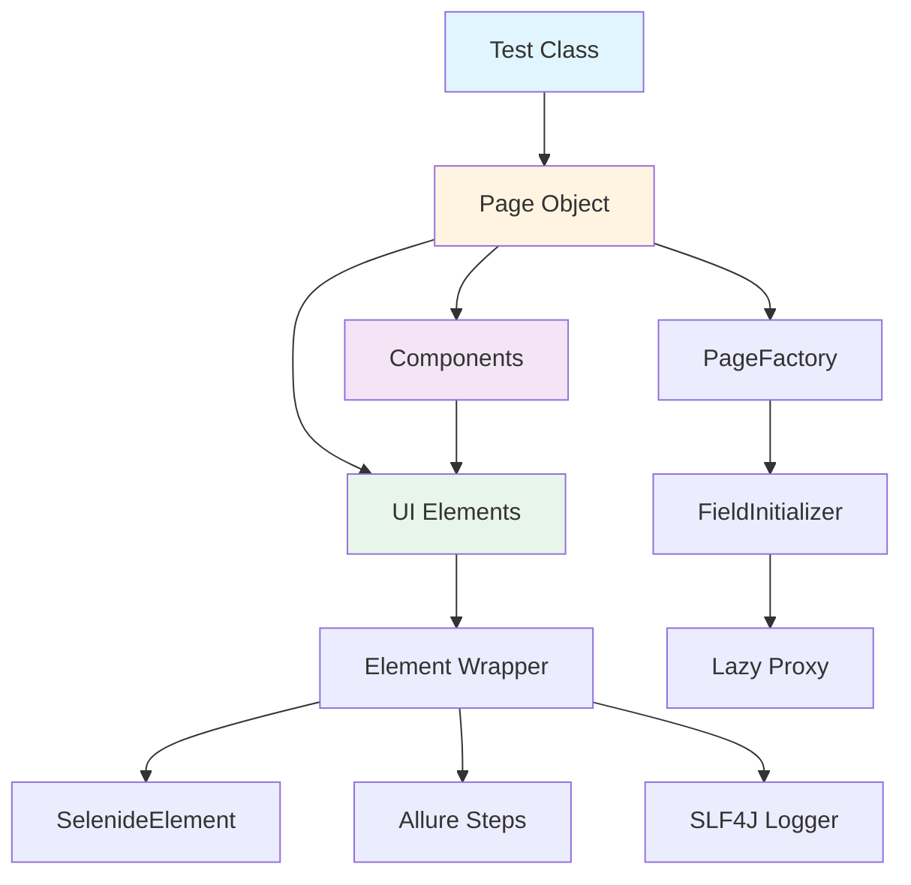

# Новый декларативный UI дизайн для Hex Framework

## Оглавление
1. [Обзор](#обзор)
2. [Ключевые принципы](#ключевые-принципы)
3. [Архитектура компонентов](#архитектура-компонентов)
4. [API и примеры использования](#api-и-примеры-использования)
5. [Внутреннее устройство](#внутреннее-устройство)
6. [Интеграция с Allure](#интеграция-с-allure)
7. [Расширяемость](#расширяемость)
8. [Миграция и совместимость](#миграция-и-совместимость)

---

## Обзор

Новый UI дизайн Hex Framework основан на **гибридном декларативно-императивном подходе**, который минимизирует boilerplate код при сохранении гибкости для сложных сценариев.

### Цели дизайна
- ✅ **Минимум boilerplate**: пользователь пишет только бизнес-логику
- ✅ **Декларативность по умолчанию**: аннотации для простых случаев
- ✅ **Fluent API для сложных случаев**: builder pattern для кастомизации
- ✅ **Lazy инициализация**: элементы создаются при первом обращении (как в Selenide)
- ✅ **Автоматические Allure steps**: из коробки с возможностью переопределения
- ✅ **Thread-safe**: без shared state, параллельное выполнение
- ✅ **Типобезопасность**: конкретные типы элементов (Input, Button, Checkbox)

### Пример использования

```java
@Page(url = "/owners/new", title = "Add Owner Page")
public class AddOwnerPage extends BasePage {
    
    @Element(name = "First Name", xpath = "//input[@id='firstName']")
    Input firstName;
    
    @Element(name = "Last Name", xpath = "//input[@id='lastName']")
    Input lastName;
    
    @Component(name = "Header", root = "//nav[@id='header']")
    HeaderComponent header;
    
    @Step("Fill owner form")
    public AddOwnerPage fillOwnerForm(Owner owner) {
        firstName.fill(owner.getFirstName());  // автоматический step
        lastName.fill(owner.getLastName());    // автоматический step
        return this;
    }
}
```

---

## Ключевые принципы

### 1. Гибридный подход: Декларативный + Builder API

**Декларативный (для простых случаев):**
```java
@Element(name = "Username", xpath = "//input[@id='username']")
Input username;

@Elements(name = "Menu Items", xpath = "//li[@class='menu-item']")
ElementList<Button> menuItems;
```

**Builder API (для сложных случаев):**
```java
// Динамический локатор
Input dynamicField = input("//input[@data-id='%s']")
    .withName("Dynamic Field")
    .withTimeout(Duration.ofSeconds(10))
    .withRetry(3);

// Использование с параметрами
dynamicField.withParam("user-123").fill("value");
```

### 2. Lazy инициализация элементов

Все элементы инициализируются **лениво** при первом обращении:
- Не падаем на динамических элементах при создании Page
- Совместимость с Selenide подходом
- Минимальные накладные расходы

```java
AddOwnerPage page = new AddOwnerPage(); // элементы НЕ инициализированы
page.firstName.fill("John");            // firstName инициализируется ЗДЕСЬ
```

### 3. Автоматическая генерация Allure steps

Каждое действие с элементом автоматически создает Allure step:

```java
// Код
firstName.fill("John");

// Allure report
└─ Fill 'First Name' with 'John'
```

Для бизнес-логики можно группировать steps:
```java
@Step("Register new user: {user.email}")
public HomePage registerUser(User user) {
    email.fill(user.getEmail());        // вложенный step
    password.fill(user.getPassword());  // вложенный step
    submitButton.click();               // вложенный step
    return new HomePage();
}

// Allure report
└─ Register new user: john@example.com
   ├─ Fill 'Email' with 'john@example.com'
   ├─ Fill 'Password' with '******'
   └─ Click 'Submit Button'
```

### 4. Fluent assertions

Все элементы поддерживают fluent assertions:
```java
firstName
    .shouldBe(visible)
    .shouldHave(value("John"))
    .shouldBe(enabled);

menuItems
    .shouldHaveSize(5)
    .filter(item -> item.getText().contains("Admin"))
    .shouldHaveSize(1);
```

### 5. Явное именование элементов

Все элементы **обязаны** иметь имя для Allure steps:
```java
@Element(name = "First Name", xpath = "//input[@id='firstName']")
Input firstName;  // ✅ Правильно

@Element(xpath = "//input[@id='firstName']")
Input firstName;  // ❌ Ошибка компиляции: name обязателен
```

---

## Архитектура компонентов

### Иерархия классов

```
BaseElement (abstract)
├── Input
├── Button
├── Checkbox
├── Select
├── TextElement
└── CustomElement (для расширения)

BaseComponent (abstract)
├── HeaderComponent
├── FooterComponent
├── ModalComponent
└── TableComponent

BasePage (abstract)
├── LoginPage
├── HomePage
└── AddOwnerPage

ElementList<T extends BaseElement>
└── Методы: filter(), find(), map(), shouldHaveSize(), etc.
```

### Диаграмма взаимодействия



---

## API и примеры использования

### 1. Базовые элементы

#### Input (текстовые поля)
```java
@Element(name = "Email", xpath = "//input[@type='email']")
Input email;

// Использование
email.fill("user@example.com");
email.clear();
email.append(" additional text");
email.shouldHave(value("user@example.com"));
email.shouldBe(visible, enabled);

String currentValue = email.getValue();
```

#### Button (кнопки)
```java
@Element(name = "Submit", xpath = "//button[@type='submit']")
Button submitButton;

// Использование
submitButton.click();
submitButton.doubleClick();
submitButton.shouldBe(visible, enabled);
submitButton.shouldHave(text("Submit"));
```

#### Checkbox (чекбоксы)
```java
@Element(name = "Accept Terms", xpath = "//input[@type='checkbox']")
Checkbox acceptTerms;

// Использование
acceptTerms.check();
acceptTerms.uncheck();
acceptTerms.toggle();
acceptTerms.shouldBe(checked);
acceptTerms.shouldBe(unchecked);

boolean isChecked = acceptTerms.isChecked();
```

#### Select (выпадающие списки)
```java
@Element(name = "Country", xpath = "//select[@id='country']")
Select country;

// Использование
country.selectByText("United States");
country.selectByValue("US");
country.selectByIndex(0);
country.shouldHave(selectedText("United States"));

String selected = country.getSelectedText();
List<String> allOptions = country.getAllOptions();
```

### 2. Коллекции элементов

```java
@Elements(name = "Product Cards", xpath = "//div[@class='product-card']")
ElementList<Button> productCards;

// Использование
productCards.shouldHaveSize(10);
productCards.shouldNotBeEmpty();

// Фильтрация
ElementList<Button> activeCards = productCards
    .filter(card -> card.getAttribute("data-status").equals("active"));

// Поиск
Button firstActive = productCards
    .findFirst(card -> card.getText().contains("Premium"));

// Маппинг
List<String> productNames = productCards
    .map(card -> card.getText())
    .collect(Collectors.toList());

// Итерация
productCards.forEach(card -> {
    card.shouldBe(visible);
    card.click();
});

// Получение по индексу
Button firstCard = productCards.get(0);
Button lastCard = productCards.last();
```

### 3. Компоненты

#### Определение компонента
```java
public class HeaderComponent extends BaseComponent {
    
    @Element(name = "Home Button", xpath = ".//a[@title='home']")
    Button homeButton;
    
    @Element(name = "Profile Menu", xpath = ".//div[@class='profile-menu']")
    Button profileMenu;
    
    @Elements(name = "Navigation Links", xpath = ".//nav//a")
    ElementList<Button> navLinks;
    
    @Step("Navigate to home from '{this.componentName}'")
    public HomePage goHome() {
        homeButton.click();
        return new HomePage();
    }
    
    @Step("Open profile menu in '{this.componentName}'")
    public HeaderComponent openProfileMenu() {
        profileMenu.click();
        return this;
    }
}
```

**Примечание:** `this.componentName` автоматически подставляется из аннотации `@Component(name = "...")` на странице.

#### Использование компонента в Page
```java
@Page(url = "/dashboard", title = "Dashboard")
public class DashboardPage extends BasePage {
    
    // Компонент с указанием root локатора и имени
    @Component(name = "Main Header", root = "//header[@id='main-header']")
    HeaderComponent header;
    
    // Компонент может быть переиспользован с разными root и именами
    @Component(name = "Sidebar Navigation", root = "//aside[@id='sidebar']")
    NavigationComponent sidebar;
    
    public HomePage navigateHome() {
        return header.goHome();
    }
}
```

### 4. Page Objects

#### Базовая структура Page
```java
@Page(url = "/login", title = "Login Page")
public class LoginPage extends BasePage {
    
    @Element(name = "Username", xpath = "//input[@id='username']")
    Input username;
    
    @Element(name = "Password", xpath = "//input[@id='password']")
    Input password;
    
    @Element(name = "Login Button", xpath = "//button[@type='submit']")
    Button loginButton;
    
    @Element(name = "Error Message", xpath = "//div[@class='error']")
    TextElement errorMessage;
    
    @Step("Login as {user}")
    public HomePage login(String user, String pass) {
        username.fill(user);
        password.fill(pass);
        loginButton.click();
        return new HomePage();
    }
    
    @Step("Verify login error: {expectedError}")
    public LoginPage verifyError(String expectedError) {
        errorMessage.shouldBe(visible);
        errorMessage.shouldHave(text(expectedError));
        return this;
    }
}
```

#### Использование в тестах
```java
@Test
public void testSuccessfulLogin() {
    LoginPage loginPage = new LoginPage().open();
    
    HomePage homePage = loginPage.login("user@example.com", "password123");
    
    homePage.header.shouldBe(visible);
    homePage.welcomeMessage.shouldHave(text("Welcome, User!"));
}

@Test
public void testFailedLogin() {
    new LoginPage()
        .open()
        .login("invalid@example.com", "wrong")
        .verifyError("Invalid credentials");
}
```

### 5. Динамические локаторы (Builder API)

```java
public class UserProfilePage extends BasePage {
    
    // Динамический элемент с параметром
    private final Input dynamicField = input("//input[@data-field='%s']")
        .withName("User Field")
        .withTimeout(Duration.ofSeconds(10));
    
    private final Button dynamicButton = button("//button[@data-action='%s']")
        .withName("Action Button");
    
    @Step("Fill user field: {fieldName} with {value}")
    public UserProfilePage fillField(String fieldName, String value) {
        dynamicField.withParam(fieldName).fill(value);
        return this;
    }
    
    @Step("Click action: {action}")
    public UserProfilePage clickAction(String action) {
        dynamicButton.withParam(action).click();
        return this;
    }
}

// Использование
userProfilePage
    .fillField("email", "new@example.com")
    .fillField("phone", "+1234567890")
    .clickAction("save");
```

### 6. Сложные сценарии с кастомизацией

```java
public class AdvancedPage extends BasePage {
    
    // Элемент с кастомными настройками
    private final Input slowLoadingField = input("//input[@id='slow']")
        .withName("Slow Loading Field")
        .withTimeout(Duration.ofSeconds(30))
        .withPollingInterval(Duration.ofMillis(500))
        .withRetry(5);
    
    // Элемент с условием видимости
    private final Button conditionalButton = button("//button[@id='conditional']")
        .withName("Conditional Button")
        .waitUntil(visible, Duration.ofSeconds(10));
    
    // Коллекция с фильтрацией
    @Elements(name = "Table Rows", xpath = "//table//tr")
    ElementList<TextElement> tableRows;
    
    @Step("Find row with text: {text}")
    public TextElement findRowByText(String text) {
        return tableRows
            .filter(row -> row.getText().contains(text))
            .findFirst()
            .orElseThrow(() -> new AssertionError("Row not found: " + text));
    }
    
    @Step("Get all active rows")
    public List<String> getActiveRowsText() {
        return tableRows
            .filter(row -> row.getAttribute("class").contains("active"))
            .map(TextElement::getText)
            .collect(Collectors.toList());
    }
}
```

### 7. Работа с таблицами

```java
public class TableComponent extends BaseComponent {
    
    @Elements(name = "Table Headers", xpath = ".//thead//th")
    ElementList<TextElement> headers;
    
    @Elements(name = "Table Rows", xpath = ".//tbody//tr")
    ElementList<RowElement> rows;
    
    @Step("Get column index by name: {columnName}")
    public int getColumnIndex(String columnName) {
        return headers
            .findFirst(h -> h.getText().equals(columnName))
            .map(headers::indexOf)
            .orElseThrow(() -> new AssertionError("Column not found: " + columnName));
    }
    
    @Step("Find row where {columnName} = {value}")
    public RowElement findRow(String columnName, String value) {
        int columnIndex = getColumnIndex(columnName);
        return rows
            .findFirst(row -> row.getCell(columnIndex).getText().equals(value))
            .orElseThrow(() -> new AssertionError("Row not found"));
    }
    
    @Step("Get all values from column: {columnName}")
    public List<String> getColumnValues(String columnName) {
        int columnIndex = getColumnIndex(columnName);
        return rows
            .map(row -> row.getCell(columnIndex).getText())
            .collect(Collectors.toList());
    }
}

// Использование
@Component(root = "//table[@id='users']")
TableComponent usersTable;

usersTable.findRow("Email", "john@example.com")
    .getCell("Status")
    .shouldHave(text("Active"));

List<String> allEmails = usersTable.getColumnValues("Email");
```

---

## Внутреннее устройство

### 1. Инициализация элементов (Lazy Proxy)

```java
public class FieldInitializer {
    
    public static void initializeFields(Object pageOrComponent) {
        Class<?> clazz = pageOrComponent.getClass();
        
        for (Field field : getAllFields(clazz)) {
            field.setAccessible(true);
            
            if (field.isAnnotationPresent(Element.class)) {
                initializeElement(pageOrComponent, field);
            } else if (field.isAnnotationPresent(Elements.class)) {
                initializeElementList(pageOrComponent, field);
            } else if (field.isAnnotationPresent(Component.class)) {
                initializeComponent(pageOrComponent, field);
            }
        }
    }
    
    private static void initializeElement(Object target, Field field) {
        Element annotation = field.getAnnotation(Element.class);
        
        // Создаем lazy proxy
        Object proxy = createLazyProxy(
            field.getType(),
            annotation.name(),
            annotation.xpath(),
            annotation.css(),
            getComponentRoot(target)
        );
        
        setField(field, target, proxy);
    }
    
    private static Object createLazyProxy(
        Class<?> elementType,
        String name,
        String xpath,
        String css,
        String componentRoot
    ) {
        return Proxy.newProxyInstance(
            elementType.getClassLoader(),
            new Class<?>[]{elementType},
            new LazyElementHandler(name, xpath, css, componentRoot)
        );
    }
}
```

### 2. Lazy Element Handler

```java
public class LazyElementHandler implements InvocationHandler {
    
    private final String name;
    private final String locator;
    private final String componentRoot;
    private volatile BaseElement cachedElement;
    
    @Override
    public Object invoke(Object proxy, Method method, Object[] args) {
        if (cachedElement == null) {
            synchronized (this) {
                if (cachedElement == null) {
                    cachedElement = createRealElement();
                }
            }
        }
        
        return method.invoke(cachedElement, args);
    }
    
    private BaseElement createRealElement() {
        SelenideElement selenideElement = findSelenideElement();
        return ElementFactory.create(elementType, name, selenideElement);
    }
    
    private SelenideElement findSelenideElement() {
        if (componentRoot != null && !componentRoot.isEmpty()) {
            return $(componentRoot).$(locator);
        }
        return $(locator);
    }
}
```

### 3. Element Factory

```java
public class ElementFactory {
    
    private static final Map<Class<?>, BiFunction<String, SelenideElement, BaseElement>> 
        ELEMENT_CREATORS = new HashMap<>();
    
    static {
        ELEMENT_CREATORS.put(Input.class, Input::new);
        ELEMENT_CREATORS.put(Button.class, Button::new);
        ELEMENT_CREATORS.put(Checkbox.class, Checkbox::new);
        ELEMENT_CREATORS.put(Select.class, Select::new);
        ELEMENT_CREATORS.put(TextElement.class, TextElement::new);
    }
    
    public static <T extends BaseElement> T create(
        Class<T> elementType,
        String name,
        SelenideElement selenideElement
    ) {
        BiFunction<String, SelenideElement, BaseElement> creator = 
            ELEMENT_CREATORS.get(elementType);
        
        if (creator == null) {
            throw new IllegalArgumentException(
                "Unknown element type: " + elementType.getName()
            );
        }
        
        return elementType.cast(creator.apply(name, selenideElement));
    }
}
```

### 4. Base Element Implementation

```java
public abstract class BaseElement {
    
    protected final String name;
    protected final SelenideElement element;
    protected final Logger logger;
    
    protected BaseElement(String name, SelenideElement element) {
        this.name = name;
        this.element = element;
        this.logger = LoggerFactory.getLogger(getClass());
    }
    
    @Step("Click '{this.name}'")
    public void click() {
        logger.info("Clicking on '{}' in page '{}' component '{}'",
            name, getPageName(), getComponentName());
        element.click();
    }
    
    @Step("'{this.name}' should be {condition}")
    public BaseElement shouldBe(WebElementCondition condition) {
        logger.info("Verifying '{}' should be {}", name, condition);
        element.shouldBe(condition);
        return this;
    }
    
    @Step("'{this.name}' should have {condition}")
    public BaseElement shouldHave(WebElementCondition condition) {
        logger.info("Verifying '{}' should have {}", name, condition);
        element.shouldHave(condition);
        return this;
    }
    
    // Fluent API для цепочки assertions
    public BaseElement shouldBe(WebElementCondition... conditions) {
        for (WebElementCondition condition : conditions) {
            shouldBe(condition);
        }
        return this;
    }
}
```

### 5. Input Implementation

```java
public class Input extends BaseElement {
    
    public Input(String name, SelenideElement element) {
        super(name, element);
    }
    
    @Step("Fill '{this.name}' with '{text}'")
    public Input fill(String text) {
        logger.info("Filling '{}' with '{}' in page '{}' component '{}'",
            name, text, getPageName(), getComponentName());
        element.clear();
        element.setValue(text);
        return this;
    }
    
    @Step("Clear '{this.name}'")
    public Input clear() {
        logger.info("Clearing '{}'", name);
        element.clear();
        return this;
    }
    
    @Step("Append '{text}' to '{this.name}'")
    public Input append(String text) {
        logger.info("Appending '{}' to '{}'", text, name);
        element.append(text);
        return this;
    }
    
    public String getValue() {
        return element.getValue();
    }
    
    // Fluent assertions
    public Input shouldHaveValue(String expectedValue) {
        shouldHave(value(expectedValue));
        return this;
    }
    
    public Input shouldBeEmpty() {
        shouldHave(empty);
        return this;
    }
}
```

### 6. ElementList Implementation

```java
public class ElementList<T extends BaseElement> implements Iterable<T> {
    
    private final String name;
    private final ElementsCollection selenideCollection;
    private final Class<T> elementType;
    
    public ElementList(String name, ElementsCollection collection, Class<T> type) {
        this.name = name;
        this.selenideCollection = collection;
        this.elementType = type;
    }
    
    @Step("Get size of '{this.name}'")
    public int size() {
        return selenideCollection.size();
    }
    
    @Step("'{this.name}' should have size {expectedSize}")
    public ElementList<T> shouldHaveSize(int expectedSize) {
        selenideCollection.shouldHaveSize(expectedSize);
        return this;
    }
    
    @Step("Filter '{this.name}'")
    public ElementList<T> filter(Predicate<T> predicate) {
        List<T> filtered = stream()
            .filter(predicate)
            .collect(Collectors.toList());
        
        // Создаем новую коллекцию из отфильтрованных элементов
        return new FilteredElementList<>(name, filtered, elementType);
    }
    
    public Optional<T> findFirst(Predicate<T> predicate) {
        return stream().filter(predicate).findFirst();
    }
    
    public T get(int index) {
        SelenideElement element = selenideCollection.get(index);
        return ElementFactory.create(elementType, name + "[" + index + "]", element);
    }
    
    public T first() {
        return get(0);
    }
    
    public T last() {
        return get(size() - 1);
    }
    
    public Stream<T> stream() {
        return IntStream.range(0, size())
            .mapToObj(this::get);
    }
    
    @Override
    public Iterator<T> iterator() {
        return stream().iterator();
    }
    
    public <R> Stream<R> map(Function<T, R> mapper) {
        return stream().map(mapper);
    }
    
    public void forEach(Consumer<T> action) {
        stream().forEach(action);
    }
}
```

---

## Интеграция с Allure

### 1. Автоматическая генерация steps

Каждый метод элемента автоматически оборачивается в Allure step с контекстным логированием:

```java
public abstract class BaseElement {
    
    protected final String name;
    protected final SelenideElement element;
    protected final Logger logger;
    protected String pageName;      // устанавливается при инициализации
    protected String componentName; // устанавливается при инициализации
    
    @Step("Click '{this.name}'")
    public void click() {
        logger.info("Clicking on '{}' in page '{}' component '{}'",
            name, pageName, componentName);
        element.click();
    }
    
    protected String getPageName() {
        return pageName != null ? pageName : "Unknown Page";
    }
    
    protected String getComponentName() {
        return componentName != null ? componentName : "Root";
    }
}
```

**Важно:** Скриншоты делаются **только при ошибках** через JUnit 5 lifecycle плагин, а не на каждом действии. Это обеспечивает:
- Меньше накладных расходов на выполнение тестов
- Более чистые Allure отчеты
- Скриншоты только там, где они действительно нужны

### 2. Параметризация steps

```java
@Step("Fill '{this.name}' with '{text}'")
public Input fill(String text) {
    // Allure автоматически подставит значения:
    // - this.name из поля класса
    // - text из параметра метода
    element.setValue(text);
    return this;
}
```

### 3. Вложенные steps

```java
@Step("Register user: {user.email}")
public HomePage registerUser(User user) {
    // Каждый вызов создает вложенный step
    email.fill(user.getEmail());        // └─ Fill 'Email' with 'john@example.com'
    password.fill(user.getPassword());  // └─ Fill 'Password' with '******'
    submitButton.click();               // └─ Click 'Submit Button'
    return new HomePage();
}
```

### 4. Контекстное логирование

Каждое действие с элементом логируется с полным контекстом:

```java
// Пример лога
INFO  - Filling 'First Name' with 'John' in page 'Add Owner Page' component 'Root'
INFO  - Clicking on 'Submit Button' in page 'Add Owner Page' component 'Root'
INFO  - Navigate to home from 'Main Header' in page 'Dashboard Page' component 'Main Header'
```

Это позволяет:
- Легко отслеживать, где произошла ошибка
- Понимать контекст действия (страница + компонент)
- Быстро находить проблемные места в логах

**Скриншоты и page source** прикрепляются автоматически через JUnit 5 lifecycle listener при падении теста.

---

## Расширяемость

### 1. Создание кастомных элементов

```java
public class RichTextEditor extends BaseElement {
    
    public RichTextEditor(String name, SelenideElement element) {
        super(name, element);
    }
    
    @Step("Set HTML content in '{this.name}'")
    public RichTextEditor setHtmlContent(String html) {
        executeScript("arguments[0].innerHTML = arguments[1]", element, html);
        return this;
    }
    
    @Step("Format text as bold in '{this.name}'")
    public RichTextEditor formatBold() {
        element.$("button[data-action='bold']").click();
        return this;
    }
    
    public String getHtmlContent() {
        return element.getAttribute("innerHTML");
    }
}

// Регистрация в ElementFactory
ElementFactory.register(RichTextEditor.class, RichTextEditor::new);

// Использование
@Element(name = "Article Content", xpath = "//div[@class='rich-editor']")
RichTextEditor articleContent;
```

### 2. Кастомные компоненты

```java
public class DatePickerComponent extends BaseComponent {
    
    @Element(name = "Date Input", xpath = ".//input[@type='date']")
    Input dateInput;
    
    @Element(name = "Calendar Icon", xpath = ".//button[@class='calendar-icon']")
    Button calendarIcon;
    
    @Elements(name = "Calendar Days", xpath = ".//td[@class='day']")
    ElementList<Button> calendarDays;
    
    @Step("Select date: {date}")
    public DatePickerComponent selectDate(LocalDate date) {
        calendarIcon.click();
        
        String dayText = String.valueOf(date.getDayOfMonth());
        calendarDays
            .findFirst(day -> day.getText().equals(dayText))
            .orElseThrow(() -> new AssertionError("Day not found: " + dayText))
            .click();
        
        return this;
    }
    
    @Step("Get selected date from '{this.name}'")
    public LocalDate getSelectedDate() {
        String dateStr = dateInput.getValue();
        return LocalDate.parse(dateStr);
    }
}
```

### 3. Кастомные условия (Conditions)

```java
public class CustomConditions {
    
    public static WebElementCondition hasClass(String className) {
        return new WebElementCondition("has class '" + className + "'") {
            @Override
            public boolean test(WebElement element) {
                String classes = element.getAttribute("class");
                return classes != null && classes.contains(className);
            }
        };
    }
    
    public static WebElementCondition hasAttribute(String attr, String value) {
        return new WebElementCondition("has attribute '" + attr + "' = '" + value + "'") {
            @Override
            public boolean test(WebElement element) {
                return value.equals(element.getAttribute(attr));
            }
        };
    }
}

// Использование
button.shouldBe(hasClass("active"));
input.shouldBe(hasAttribute("data-status", "valid"));
```

### 4. Плагины и перехватчики

```java
public interface ElementInterceptor {
    void beforeAction(BaseElement element, String action);
    void afterAction(BaseElement element, String action);
    void onError(BaseElement element, String action, Exception e);
}

public class LoggingInterceptor implements ElementInterceptor {
    
    @Override
    public void beforeAction(BaseElement element, String action) {
        logger.info("Before {}: {}", action, element.getName());
    }
    
    @Override
    public void afterAction(BaseElement element, String action) {
        logger.info("After {}: {}", action, element.getName());
    }
    
    @Override
    public void onError(BaseElement element, String action, Exception e) {
        logger.error("Error during {} on '{}' in page '{}' component '{}': {}",
            action, element.getName(), element.getPageName(),
            element.getComponentName(), e.getMessage(), e);
    }
}

// Регистрация
ElementInterceptorRegistry.register(new LoggingInterceptor());
ElementInterceptorRegistry.register(new MetricsInterceptor());
```

---

## Преимущества нового дизайна

### 1. Минимум boilerplate кода

Декларативный подход с аннотациями значительно сокращает количество кода:

```java
@Page(url = "/form", title = "Form Page")
public class FormPage extends BasePage {
    @Element(name = "Name", xpath = "//input[@id='name']")
    Input name;
    
    @Element(name = "Email", xpath = "//input[@id='email']")
    Input email;
    
    @Component(name = "Header", root = "//header")
    HeaderComponent header;
}
```

**Экономия:** ~40-50% кода по сравнению с традиционным подходом

### 2. Автоматические Allure steps

Не нужно вручную добавлять `@Step` на каждое действие:

```java
// Автоматически создаются steps:
page.email.fill("test@example.com");     // Fill 'Email' with 'test@example.com'
page.password.fill("secret");            // Fill 'Password' with '******'
page.submitButton.click();               // Click 'Submit Button'
```

### 3. Fluent API

Цепочки вызовов делают код более читаемым:

```java
page.username
    .fill("john@example.com")
    .shouldBe(visible, enabled)
    .shouldHaveValue("john@example.com");
```

### 4. Type Safety

Компилятор проверяет типы элементов:

```java
Input email;
email.fill("text");      // ✅ OK
email.check();           // ❌ Compile error - метод только для Checkbox

Checkbox terms;
terms.check();           // ✅ OK
terms.fill("text");      // ❌ Compile error - метод только для Input
```

### 5. Коллекции с функциональным API

```java
List<String> activeUsers = userRows
    .filter(row -> row.getAttribute("class").contains("active"))
    .map(row -> row.getText())
    .collect(Collectors.toList());
```

### 6. Lazy инициализация

Не падаем на динамических элементах:

```java
ModalPage modal = new ModalPage();  // OK, элементы не инициализированы
// ... модалка открывается ...
modal.closeButton.click();          // Элемент инициализируется здесь
```

---

## Ключевые особенности

| Аспект | Реализация |
|--------|------------|
| **Boilerplate код** | Минимальный - только аннотации |
| **Allure steps** | Автоматически с контекстным логированием |
| **Типизация** | Конкретные классы (Input, Button, Checkbox, Select) |
| **Инициализация** | Lazy через Proxy (при первом обращении) |
| **Fluent API** | Да - цепочки вызовов |
| **Коллекции** | ElementList<T> с filter/map/find |
| **Динамические локаторы** | Builder API с параметрами |
| **Кастомизация** | Builder API + расширение через наследование |
| **Логирование** | SLF4J с полным контекстом (page + component + element) |
| **Скриншоты** | Только при ошибках через JUnit 5 lifecycle |
| **Thread-Safety** | Да - lazy инициализация без shared state |

---

## Roadmap реализации

### Phase 1: Core Infrastructure (Epic 3.1)
- [ ] [`BaseElement`](hex-core-ui/src/main/java/com/company/hex/ui/core/BaseElement.java) - базовый класс элементов
- [ ] [`Input`](hex-core-ui/src/main/java/com/company/hex/ui/elements/Input.java), [`Button`](hex-core-ui/src/main/java/com/company/hex/ui/elements/Button.java), [`Checkbox`](hex-core-ui/src/main/java/com/company/hex/ui/elements/Checkbox.java), [`Select`](hex-core-ui/src/main/java/com/company/hex/ui/elements/Select.java) - базовые элементы
- [ ] [`@Element`](hex-core-ui/src/main/java/com/company/hex/ui/annotations/Element.java), [`@Elements`](hex-core-ui/src/main/java/com/company/hex/ui/annotations/Elements.java) - аннотации
- [ ] [`FieldInitializer`](hex-core-ui/src/main/java/com/company/hex/ui/factory/FieldInitializer.java) - инициализация полей
- [ ] [`LazyElementHandler`](hex-core-ui/src/main/java/com/company/hex/ui/proxy/LazyElementHandler.java) - lazy proxy

### Phase 2: Collections & Components (Epic 3.2)
- [ ] [`ElementList<T>`](hex-core-ui/src/main/java/com/company/hex/ui/collections/ElementList.java) - коллекции элементов
- [ ] [`BaseComponent`](hex-core-ui/src/main/java/com/company/hex/ui/core/BaseComponent.java) - базовый класс компонентов
- [ ] [`@Component`](hex-core-ui/src/main/java/com/company/hex/ui/annotations/Component.java) - аннотация компонента
- [ ] Component scoping (root локаторы)

### Phase 3: Builder API (Epic 3.3)
- [ ] [`ElementBuilder`](hex-core-ui/src/main/java/com/company/hex/ui/builder/ElementBuilder.java) - fluent builder
- [ ] Динамические локаторы с параметрами
- [ ] Кастомизация timeout/retry/polling

### Phase 4: Allure Integration (Epic 3.4)
- [ ] Автоматическая генерация steps с контекстом
- [ ] Параметризация step names (page + component + element)
- [ ] Контекстное логирование через SLF4J
- [ ] Интеграция с JUnit 5 lifecycle для скриншотов при ошибках

### Phase 5: Advanced Features (Epic 3.5)
- [ ] Кастомные элементы (RichTextEditor, DatePicker, etc.)
- [ ] Interceptors и плагины
- [ ] Кастомные Conditions
- [ ] Метрики и мониторинг

### Phase 6: Documentation & Examples (Epic 3.6)
- [ ] Примеры в [`hex-project-samples`](hex-project-samples/)
- [ ] README с примерами использования
- [ ] JavaDoc для всех публичных API
- [ ] Migration guide (если потребуется)

---

## Заключение

Новый декларативный UI дизайн Hex Framework обеспечивает:

✅ **Минимум boilerplate** - пользователь пишет только бизнес-логику  
✅ **Декларативность** - аннотации для простых случаев  
✅ **Гибкость** - builder API для сложных сценариев  
✅ **Автоматизация** - Allure steps из коробки  
✅ **Type Safety** - компилятор проверяет типы  
✅ **Читаемость** - fluent API и понятные имена  
✅ **Расширяемость** - легко добавлять кастомные элементы  
✅ **Thread-Safety** - lazy инициализация без shared state  

Этот дизайн позволяет разработчикам тестов **фокусироваться на бизнес-логике**, а не на технических деталях работы с UI элементами.